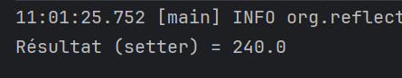

# Mini-projet : Framework d’Injection de Dépendances façon Spring

## Objectif du projet

Ce mini-projet a pour objectif de créer un framework léger d’injection de dépendances en Java, inspiré de Spring. Il permet l'injection via :

- les annotations personnalisées (`@Component`, `@Inject`, `@PostConstruct`),
- les fichiers de configuration XML (avec JAXB),
- plusieurs types d’injection : par constructeur, par setter, par champ.

Le framework permet également d'utiliser des méthodes d'initialisation après injection, similaires à `@PostConstruct` de Spring.


## Structure du projet

```
dependency-injection-spring_miniprojet/
│
├── net.mayssam.annotation/      # Annotations personnalisées
├── net.mayssam.context/         # Contexte d’application (Annotation/XML)
├── net.mayssam.dao/             # Interface et implémentation DAO
├── net.mayssam.metier/          # Couches métier avec différentes injections
├── net.mayssam.pres/            # Classes de test (main)
├── net.mayssam.utils/           # Scanner de classes
├── net.mayssam.xml/             # Modèle JAXB pour parsing XML
├── beans.xml                    # Config XML injection setter
├── beans-const.xml              # Config XML injection constructeur
├── beans-att.xml                # Config XML injection champ
```


## Fonctionnement de l’injection

### Annotations définies

- `@Component(id="...")` : Marque une classe comme un bean à instancier.
- `@Inject` : Marque un champ, constructeur ou méthode setter à injecter.
- `@PostConstruct` : Marque une méthode à exécuter après l’injection.

### Contexte d’Application

Deux implémentations permettent de créer et gérer les beans :
- `AnnotationApplicationContext(String basePackage)` : scanne le package pour instancier les beans annotés.
- `XmlApplicationContext(String configFile)` : parse un fichier XML de configuration via JAXB.


## Injection par Annotations

### Exemple avec `MetierImpl`

```java
@Inject
private IDao dao;

@PostConstruct
public void init() {
    initialValue = dao.getData() * 10;
}
```

Utilisation :
```java
AnnotationApplicationContext context = new AnnotationApplicationContext("net.mayssam");
IMetier metier = (IMetier) context.getBean("metierImpl");
System.out.println("Résultat : " + metier.calcul());
```

### Autres formes :
- `MetierImplConstructor` : injection via constructeur annoté `@Inject`
- `MetierImplSetter` : injection via méthode setter annotée `@Inject`


## Injection par XML

Fichier `beans.xml` :
```xml
<bean id="dao" class="net.mayssam.dao.DaoImpl"/>
<bean id="metierImpl3" class="net.mayssam.metier.MetierImpl3" init-method="init">
    <property name="dao" ref="dao"/>
</bean>
```

Utilisation :
```java
XmlApplicationContext ctx = new XmlApplicationContext("beans.xml");
IMetier metier = (IMetier) ctx.getBean("metierImpl3");
System.out.println("Résultat : " + metier.calcul());
```


## Présentations (Tests) disponibles

- `PresAnnotationAttr.java` : injection via champ avec annotation
- `PresAnnotationConstr.java` : injection via constructeur avec annotation
- `PresAnnotationSetter.java` : injection via setter avec annotation
- `PresXmlAttr.java` : injection XML via champ
- `PresXmlConstr.java` : injection XML via constructeur
- `PresXmlSetter.java` : injection XML via setter
  
##Resultats
### Injection avec Annotations




### Injection avec XML


##  Injection avec Annotations

L'injection est réalisée directement dans le code Java à l'aide d'annotations personnalisées comme `@Component`, `@Inject` et `@PostConstruct`.

### Avantages
-  Configuration intégrée directement dans le code.
-  Lisibilité accrue : les dépendances sont visibles à l’intérieur de la classe.
-  Plus moderne, proche de la façon de faire dans Spring.
-  Moins de fichiers à maintenir.

###  Inconvénients
-  Moins de séparation entre configuration et logique métier.
-  Les modifications de dépendances nécessitent une recompilation.
-  Moins flexible pour des environnements dynamiques ou modulaires.


##  Injection avec XML

L’injection est définie de manière déclarative dans un fichier XML externe (`beans.xml`).

###  Avantages
-  Séparation claire entre configuration et code métier.
-  Les dépendances peuvent être changées sans toucher au code.
-  Adaptée aux projets nécessitant plusieurs environnements de configuration.

###  Inconvénients
-  Syntaxe plus verbeuse et parfois lourde.
-  Moins lisible : il faut consulter le XML pour connaître les dépendances.
-  Risque accru d’erreurs de nommage (ex: fautes de frappe dans les IDs).


## Implémentation du framework

### AnnotationApplicationContext.java

- Scanne le package (`ClassScanner`) à la recherche des classes `@Component`
- Instancie les classes, gère l’injection `@Inject`, exécute `@PostConstruct`

### XmlApplicationContext.java

- Charge le fichier XML via JAXB (classes : `Beans`, `BeanDefinition`, `Property`, `ConstructorArg`)
- Crée les objets à partir des fichiers XML, effectue les injections, exécute les méthodes `init-method`


## Conclusion

Ce projet montre comment construire un mini-framework d'injection de dépendances en Java, basé sur les principes de Spring : séparation des responsabilités, injection flexible et configuration externalisée.

Il permet aussi de mieux comprendre le fonctionnement interne d’un conteneur IoC (Inversion of Control) comme celui de Spring Framework.


## Auteur

**Nom** : Mayssam Sehait  
**Projet universitaire Master SDIA**  
**GitHub** : [https://github.com/MayssamSe/dependency-injection-spring_miniprojet](https://github.com/MayssamSe/dependency-injection-spring_miniprojet)
